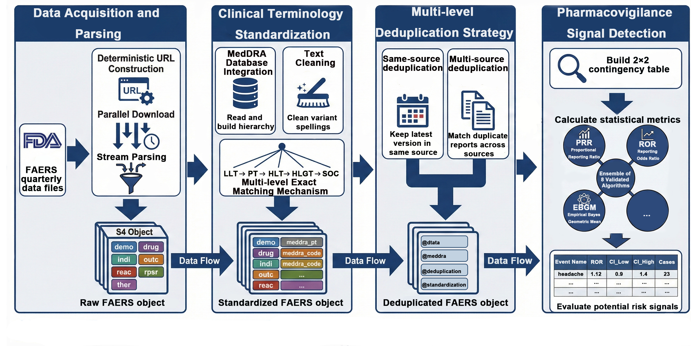

<!-- README.md is generated from README.Rmd. Please edit that file -->

# faers

<!-- badges: start -->

[](https://www.bioconductor.org/packages/devel/bioc/html/faers.html#archives)
[](https://github.com/WangLabCSU/faers/actions/workflows/R-CMD-check.yaml)
[](https://www.repostatus.org/#active)
[](https://deepwiki.com/WangLabCSU/faers)
<!-- badges: end -->

Modern biologics, such as immune checkpoint inhibitors, exhibit complex
toxicity profiles that are often underrepresented in pre-market clinical
trials. While the FAERS database serves as a critical resource for
real-world safety surveillance, its intricate relational structure and
data inconsistencies pose significant barriers to large-scale
epidemiological analyses.

To address these challenges, we developed `faers`, an end-to-end,
reproducible framework for precision pharmacovigilance. The package
streamlines the entire workflow—from raw data acquisition and rigorous
preprocessing to signal detection—empowering researchers to transform
vast spontaneous reporting data into actionable clinical insights.

# <p align="center">
# 
# 
# </p>

## Key Features

- 📥 **Data Acquisition**: Automated downloading and parsing of FAERS
  quarterly data (supporting both ASCII and XML formats).

- 🛠️ **Rigorous Preprocessing**:Multi-quarter data merging and
  deduplication logic for data quality control.

- 🔍 **Terminology Standardization**: Integration with MedDRA and RxNorm
  for precise mapping of drugs and adverse events.

- 📊 **Advanced Signal Detection**: Comprehensive disproportionality
  analysis, including ROR, PRR, BCPNN, and EBGM.

- ⚡ **High-Performance Computing**: BiocParallel integration for
  memory-efficient, parallelized processing.

- 🌐 **Knowledge Integration**: Support for Athena drug vocabularies and
  Standardized MedDRA Queries (SMQ) for mechanism-driven research.

## Installation

To install from Bioconductor, use the following code:

``` r
if (!requireNamespace("BiocManager", quietly = TRUE)) {
    install.packages("BiocManager")
}
BiocManager::install("faers")
```

You can install the development version of `faers` from
[GitHub](https://github.com/WangLabCSU/faers) with:

``` r
if (!requireNamespace("pak", quietly = TRUE)) {
    install.packages("pak", repos = "https://r-lib.github.io/p/pak/stable")
}
pak::pkg_install("WangLabCSU/faers")
```

## Quick Start

The faers package provides a standardized pipeline that unifies complex
pharmacovigilance workflows. For a comprehensive, step-by-step
demonstration—including data acquisition and a complete Insulin case
study—please refer to our detailed documentation:

The following workflow demonstrates how to perform a basic
pharmacovigilance analysis for **Aspirin** using `faers`.

``` r
library(faers)

# 1. Download and Parse Data (2023 Q1-Q2)
# Note: Ensure you have enough disk space in the target directory
data <- faers(2023, c("q1", "q2"), dir = "./faers_data")

# 2. Standardization (Requires MedDRA dictionary)
data_stand <- faers_standardize(data, meddra_path = "path/to/MedDRA")

# 3. Deduplication (Requires Standardized data)
data_dedup <- faers_dedup(data_stand)

# 4.Signal Detection (Data screening for items of interest is needed, such as "aspirin".)
results <- faers_phv_signal(
    faers_filter(data_dedup, .fn = ~ drugname == "aspirin"),
    .full = data_dedup
)
```

## Documentation

The official documentation provides comprehensive guides for both
clinical researchers and bioinformaticians.

- 🌐 **[Official Website](https://MadDERt.github.io/faers/)**: The
  central portal for package overview and function references.
- 🚀 **[Full Workflow
  Tutorial](https://MadDERt.github.io/faers/articles/full-workflow.html)**:
  A complete end-to-end analysis case study (e.g., Insulin-related
  adverse events).
- 🧭 **[Getting Started:
  Portal](https://MadDERt.github.io/faers/articles/faers.html)**:
  Quick-start guide and roadmap for using the `faers` package.

## Contributing

Contributions are what make the open-source community such an amazing
place to learn, inspire, and create. Any contributions you make are
**greatly appreciated**.

1.  **Report Bugs**: Submit an
    [issue](https://github.com/WangLabCSU/faers/issues) if you find any
    calculation errors or data parsing failures.

2.  **Feature Requests**: Have an idea for a new signal detection
    algorithm? Open an issue to discuss it.

3.  **Pull Requests**:

    - Fork the project.

    - Create your Feature Branch
      (`git checkout -b feature/AmazingFeature`).

    - Commit your changes (`git commit -m 'Add some AmazingFeature'`).

    - Push to the Branch (`git push origin feature/AmazingFeature`).

    - Open a Pull Request.
